# Food-ordering-system

## Description
This is a web application for food ordering, focusing on delivering delicious Japanese cuisine to customers' doorsteps. The system provides a sleek, simple, and easy-to-use interface for users to view and order their favorite dishes at their leisure.

## Features
- **Home Page**: Overview of website's content, including popular dishes, team information, and customer reviews.
- **Dishes Page**: Displays special dishes available for the day.
- **Navigation Menu**: Allows access to all pages on the website, including home, menu, contact, about us, dishes, logout, and cart.
- **About Us Page**: Details about the restaurant, including environment and operation time.
- **Contact Page**: Contact form and information to get in touch with the team.
- **Menu Page**: List of Japanese dishes with photos, descriptions, ratings, and prices.
- **Dish Details Page**: More information about a dish, including ingredients and allergen information, with the option to add to cart.
- **Cart Page**: Displays items added to the cart, with options to proceed to checkout, save for later, or delete items.
- **Checkout Page**: Allows users to enter personal details and address for delivery.
- **Payment Page**: Allows users to make payment using credit/debit card.
- **Login Page**: Required for accessing other web pages.
- **Responsive Design**: Pages function properly on various devices, including desktop computers, laptops, tablets, and smartphones.

## Getting Started
To get started, follow these steps:
1. Import `db.sql`, `db2.sql`, and `foodrestaurant.sql` to PHPMyAdmin.
2. Copy and paste everything in 'Group 7_Wong Ke Xin_2001293/webassignment' into 'wamp64/www/'.
3. In the browser, go to: `localhost/login.php`.
4. Create an account, browse the menu, add dishes to your cart, review your order, and checkout securely using your credit/debit payment method.

Enjoy your delicious Japanese meal delivered straight to your door!

## Screenshots

### 🏠 Home Page

  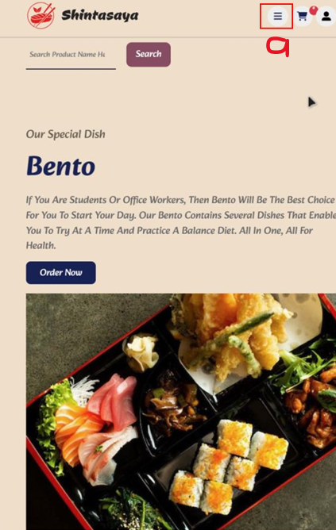

  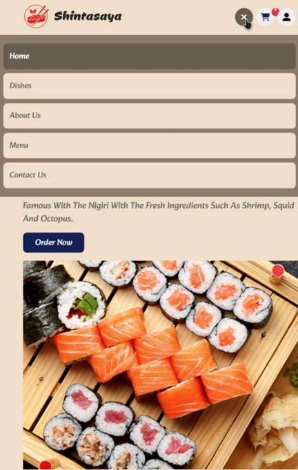

### 🍱 Dish Pages

  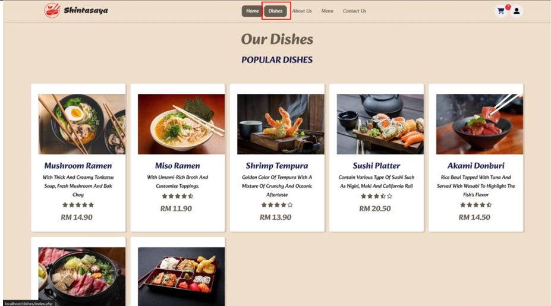

  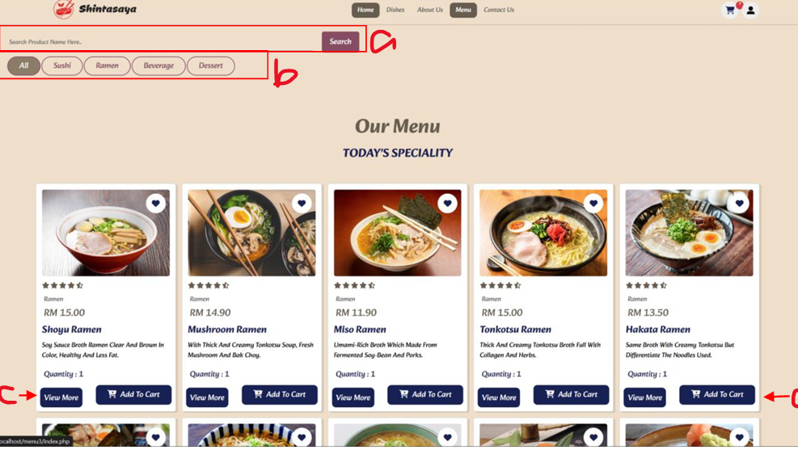

### 📄 Dish Details Page

  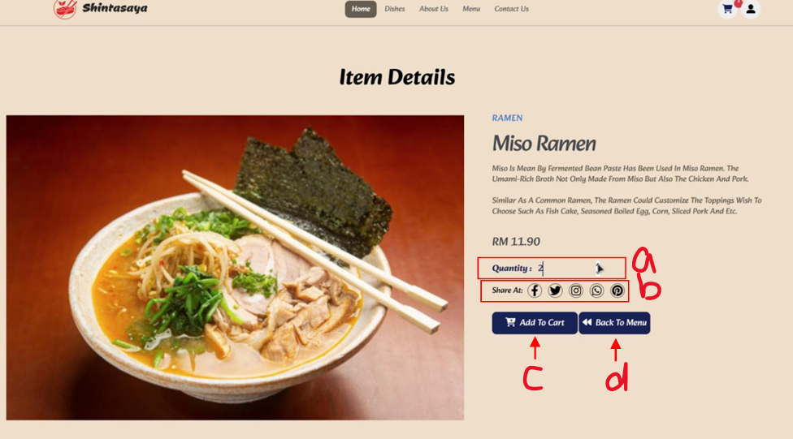

### 🛒 Cart Page

  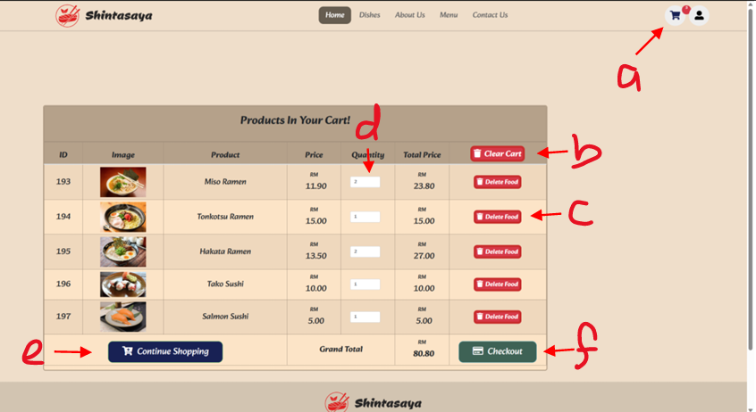

### 💳 Checkout Page

  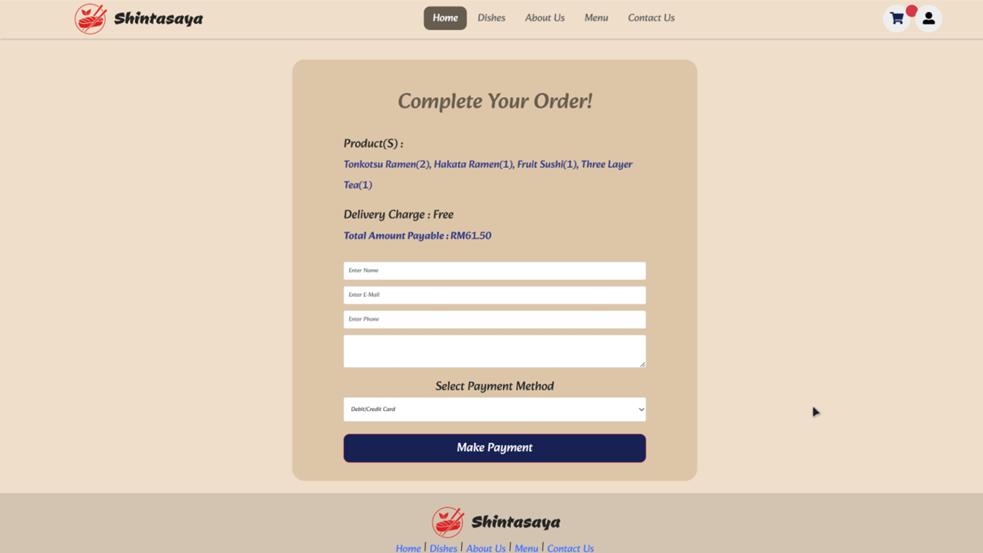

### 💰 Payment Pages

  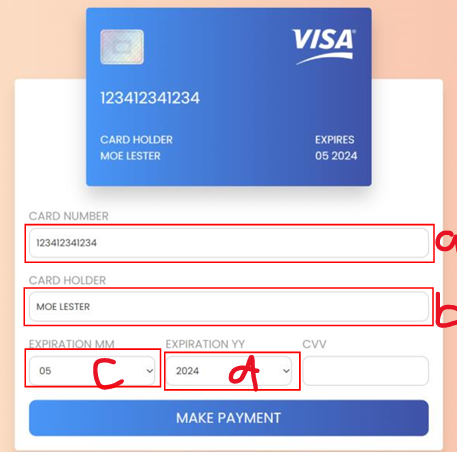

  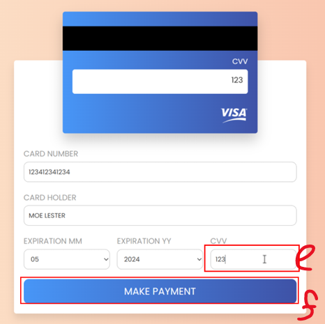

  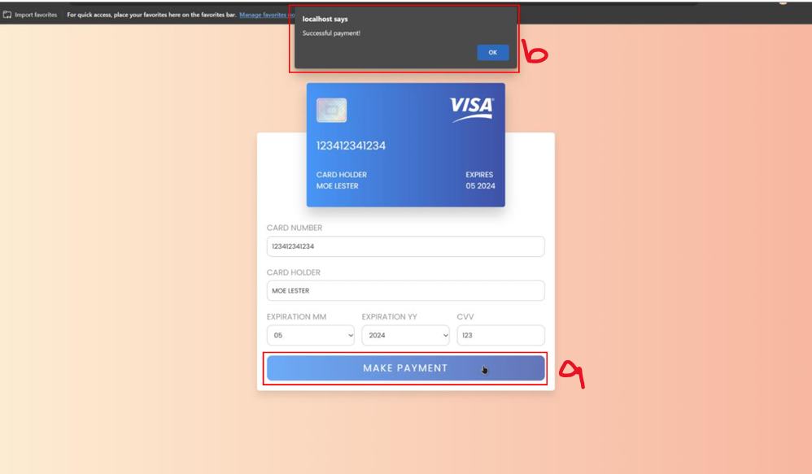

### 🔑 Login and Register Pages

  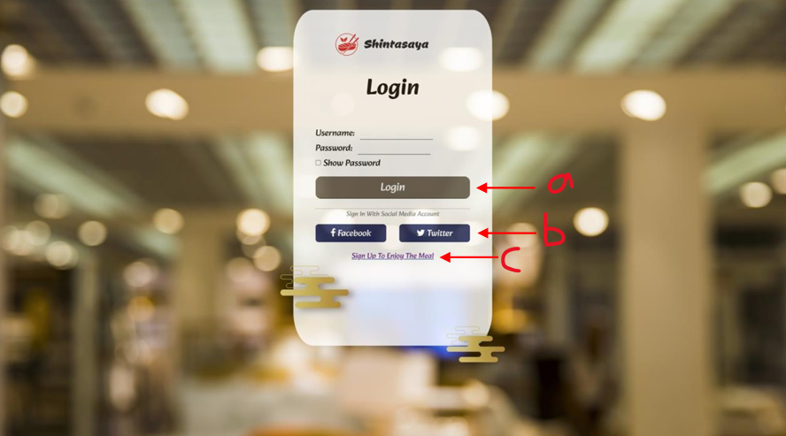

  

  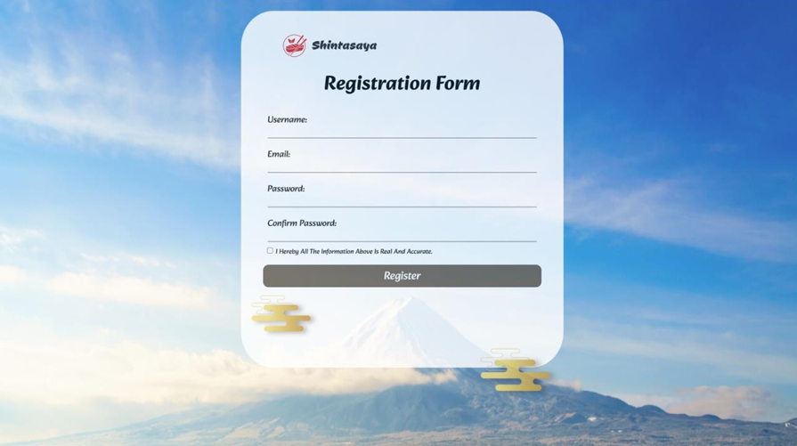

### 📋 About Us Page

  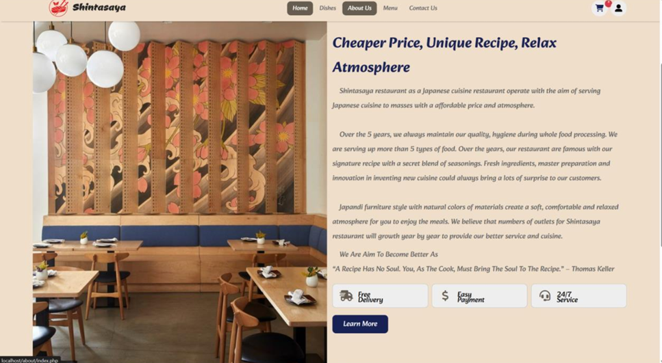

### 📞 Contact Us Pages

  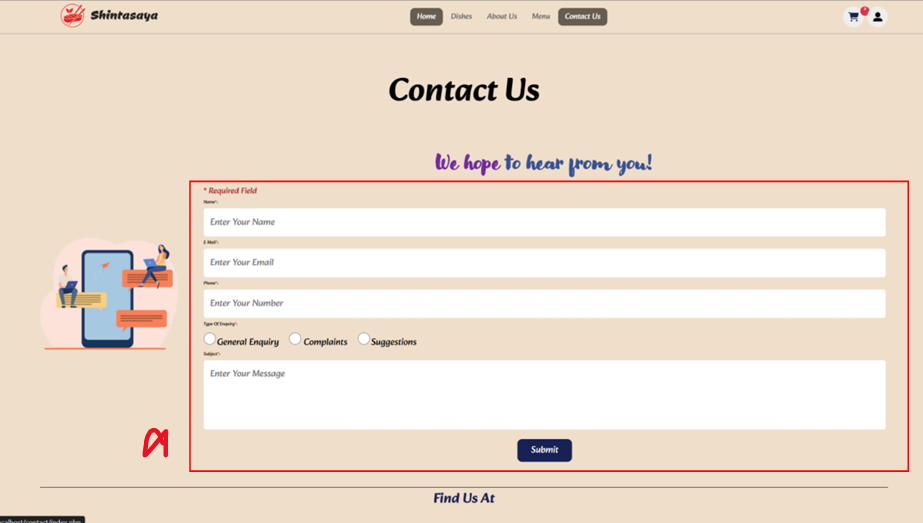

  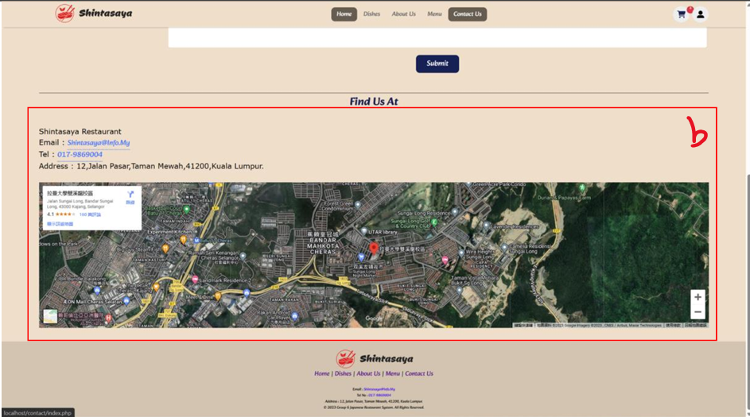

### 💬 Customer Review

  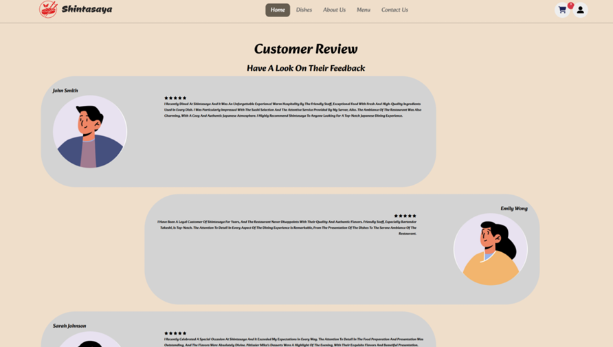

### 👥 Our Team

  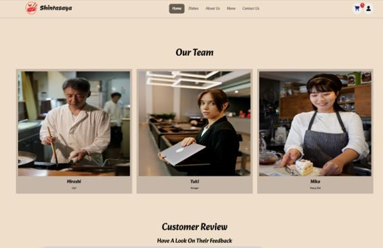

### 🌟 Features and Services

  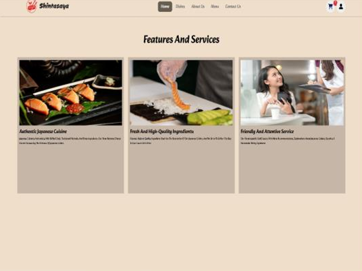

### 📄 Page Footer

  

